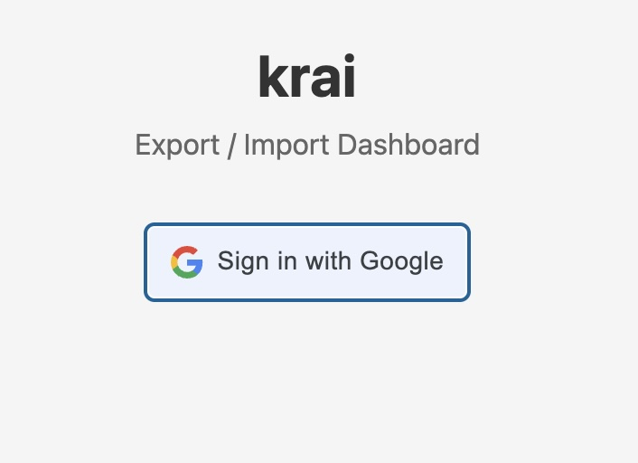
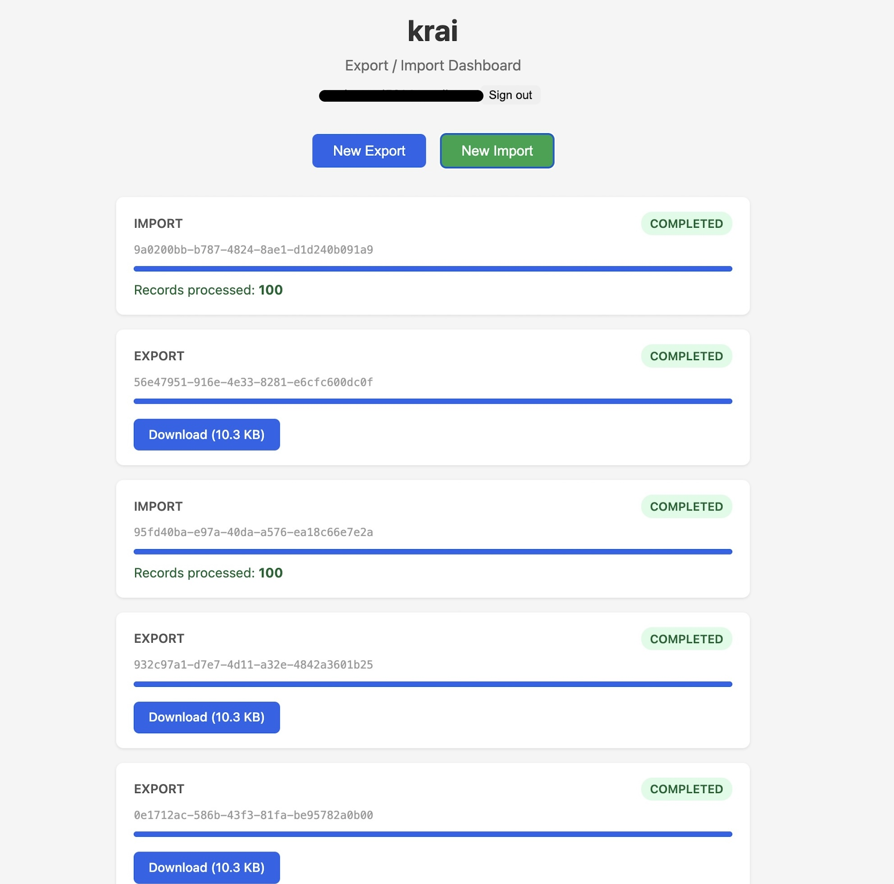
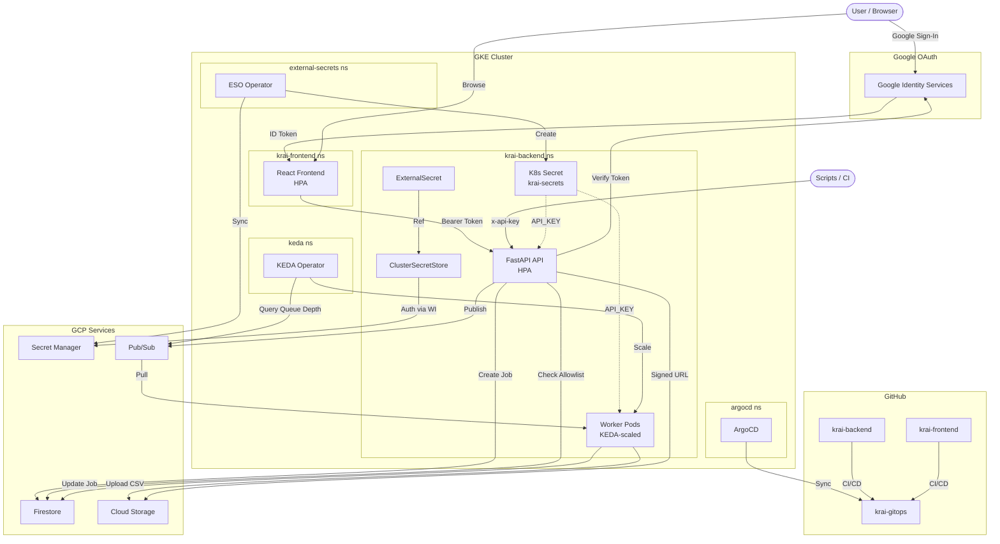
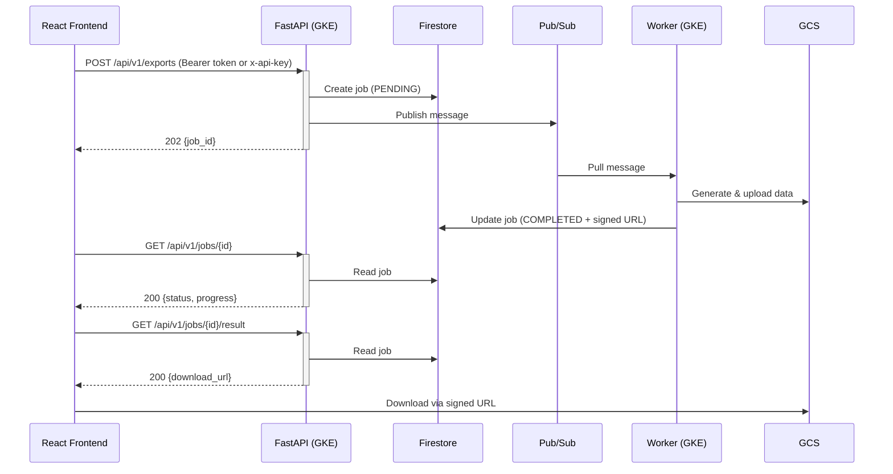
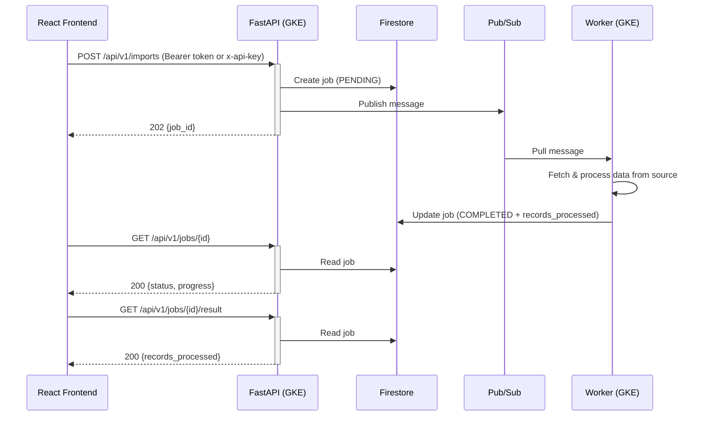
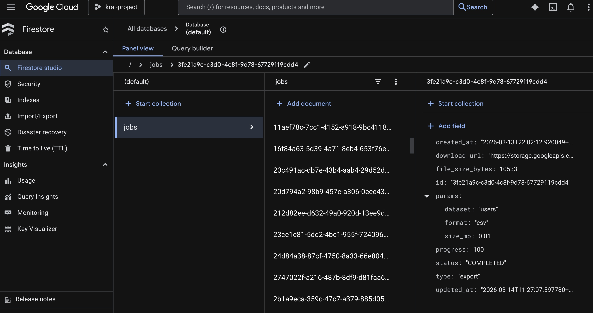
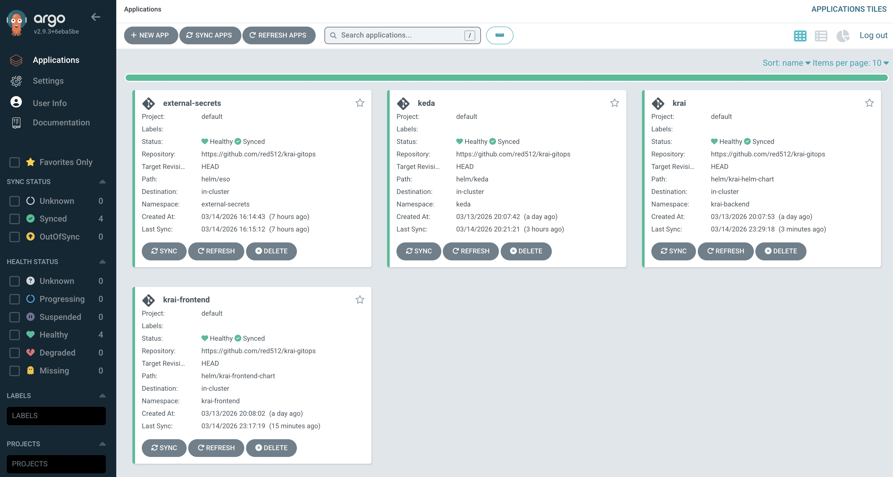
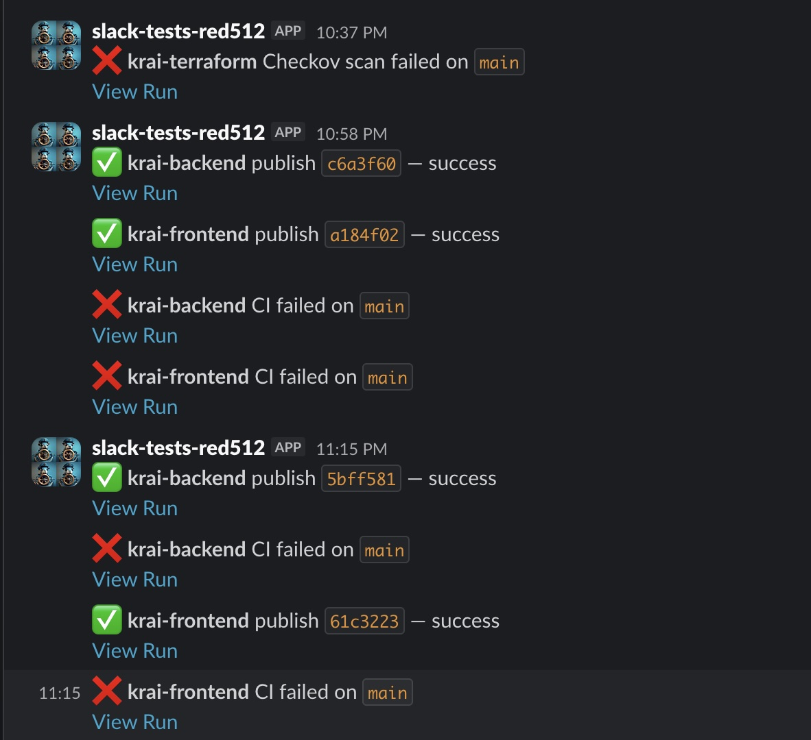
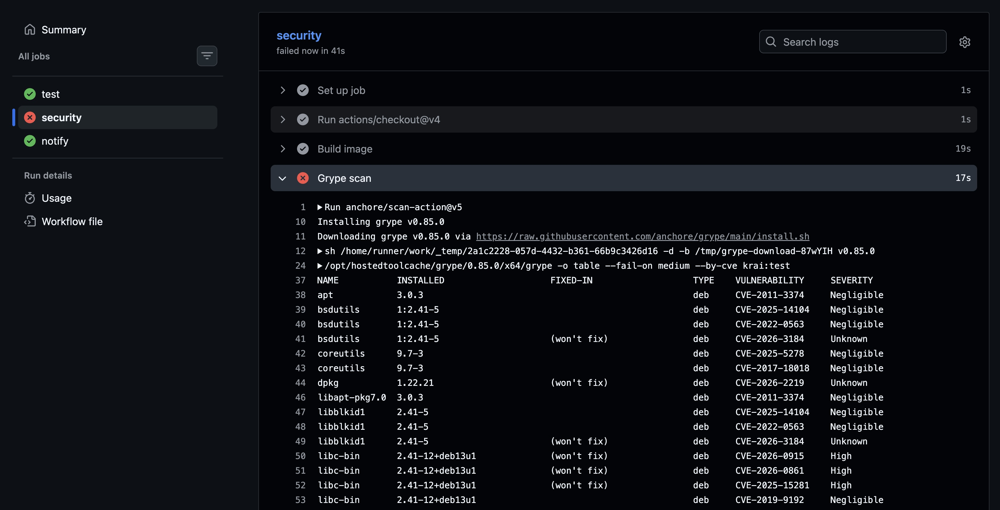

# krai — Long-Running Export/Import API

Async export/import API built with FastAPI + React frontend, deployed on GKE with Pub/Sub, GCS, and Firestore.





## Directory Structure

```
krai/
├── .github/workflows/
│   ├── ci.yaml                # Lint (ruff) → Test (pytest) → Grype scan → Slack
│   └── cd.yaml                # Docker build → Artifact Registry → update krai-gitops → Slack
├── main.py                    # FastAPI API server (exports, imports, job status)
├── worker.py                  # Pub/Sub pull subscriber (processes jobs)
├── test_main.py               # Unit + integration tests (TestClient, mock mode)
├── scripts/
│   ├── test-api.sh            # E2E test script
│   └── manage-users.sh        # Firestore email allowlist management
├── requirements.txt           # Production dependencies
├── requirements-dev.txt       # Dev dependencies (pytest, ruff)
├── Dockerfile                 # Python 3.12-slim, non-root krai user
└── media/                     # Screenshots for README
```

## Architecture

### Infrastructure Overview



### Export Flow



### Import Flow



## Key Design Decisions

| Decision | Why |
|----------|-----|
| **Signed URLs** | API server never buffers 1-100MB files |
| **Pub/Sub** | Decouples API from workers, natural backpressure |
| **Firestore** | Serverless job tracking, no schema migrations |


| **GKE + HPA** | Auto-scales API pods on CPU |
| **KEDA** | Scales worker pods based on Pub/Sub queue depth (messages per worker) instead of CPU |
| **Workload Identity** | No static credentials (GCP's IRSA equivalent) |
| **External Secrets Operator** | API key synced from GCP Secret Manager — no plaintext secrets in Helm values |
| **Google OAuth + API Key** | Dual auth: browser users sign in with Google, scripts use API key |
| **Firestore email allowlist** | OAuth users checked against `allowed_emails` collection — manage access without redeployment |
| **Separate namespaces** | `krai-backend` and `krai-frontend` deploy and scale independently |

### Worker Autoscaling (KEDA)

API pods scale on CPU via standard HPA — CPU correlates well with HTTP request load. Worker pods use [KEDA](https://keda.sh/) to scale on Pub/Sub queue depth instead, because a worker could be idle-polling at low CPU while messages pile up.

KEDA checks the `krai-jobs-sub` subscription every 15s and calculates: `desired workers = undelivered messages / messagesPerWorker (5)`.

| Messages in queue | Workers | Reason |
|---|---|---|
| 0 | 1 | `minReplicaCount` keeps at least 1 worker running |
| 1–5 | 1 | ≤ 5 / 5 = 1 worker needed |
| 6–10 | 2 | 6 / 5 = 1.2 → rounds up to 2 |
| 11–15 | 3 | 11 / 5 = 2.2 → rounds up to 3 |
| 16+ | 3 | Capped at `maxReplicaCount: 3` |
| 0 (after burst) | 1 | Scales down after 60s `cooldownPeriod` |

## Quick Start (Local)

```bash
# Backend (mock mode — no GCP credentials needed)
cd krai
pip install -r requirements.txt
python main.py

# In another terminal — E2E test
bash scripts/test-api.sh

# Frontend
cd krai-frontend
npm install
npm start
```

## API Reference

All endpoints (except `/healthz`) require authentication: either `x-api-key` header or `Authorization: Bearer <google-id-token>`.

| Method | Path | Description | Response |
|--------|------|-------------|----------|
| GET | `/healthz` | Health check | 200 |
| POST | `/api/v1/exports` | Create export job | 202 `{job_id, status}` |
| POST | `/api/v1/imports` | Create import job | 202 `{job_id, status}` |
| GET | `/api/v1/jobs/{id}` | Poll job status | 200 `{status, progress}` |
| GET | `/api/v1/jobs/{id}/result` | Get result (when completed) | 200 `{download_url}` or `{records_processed}` |

## Deploy to GKE

```bash
# 1. Provision infrastructure
cd krai-terraform
terraform init
terraform apply -var="project_id=YOUR_PROJECT" -var="api_key=YOUR_API_KEY"

# 2. ArgoCD auto-syncs all Helm charts from krai-gitops
#    - external-secrets     → external-secrets namespace (ESO operator)
#    - keda                 → keda namespace (KEDA operator)
#    - krai-helm-chart      → krai-backend namespace
#    - krai-frontend-chart  → krai-frontend namespace
```



## Multi-Repo Layout

| Repo | Purpose |
|------|---------|
| **krai** | Backend API + worker (FastAPI, Python) |
| **krai-frontend** | React frontend |
| **krai-gitops** | Helm charts + ArgoCD manifests (backend, frontend, KEDA, ESO) |
| **krai-terraform** | Terraform IaC (GKE, VPC, IAM, GCS, Pub/Sub, Firestore, Artifact Registry, Secret Manager, GitHub OIDC) |

## GKE Namespace Layout

```
external-secrets namespace: ESO operator + webhook + cert-controller
keda namespace:             KEDA operator + metrics server
krai-backend namespace:     API pods + Worker pods (KEDA-scaled) + LoadBalancer Service + ExternalSecret
krai-frontend namespace:    React pods + LoadBalancer Service
```

## CI/CD Pipeline

Each repo has its own GitHub Actions workflows:

| Repo | CI (`ci.yaml`) | CD (`cd.yaml`) |
|------|----------------|----------------|
| **krai-backend** | Lint (ruff) → Test (pytest) → Grype scan → Slack | Docker build → Push to Artifact Registry → Update image tag in krai-gitops → Slack |
| **krai-frontend** | Build → Grype scan → Slack | Docker build → Push to Artifact Registry → Update image tag in krai-gitops → Slack |
| **krai-terraform** | Checkov IaC security scan → Slack (`checkov.yaml`) | — |
| **krai-gitops** | — (ArgoCD auto-syncs on push) | — |





GitHub Actions authenticates to GCP via **Workload Identity Federation** (OIDC) — no static credentials. Terraform provisions the identity pool, provider, and a dedicated `github-actions` service account with `artifactregistry.writer` role only.

### GitHub Secrets Required

Set these on `krai-backend`, `krai-frontend`, and `krai-terraform` repos:

| Secret | Repos | Source |
|--------|-------|--------|
| `GCP_WORKLOAD_IDENTITY_PROVIDER` | backend, frontend | `terraform output gcp_workload_identity_provider` |
| `GCP_SERVICE_ACCOUNT` | backend, frontend | `terraform output github_actions_service_account` |
| `GCP_PROJECT_ID` | backend, frontend | Your GCP project ID |
| `GITOPS_PAT` | backend, frontend | GitHub PAT with `repo` scope for krai-gitops |
| `SLACK_WEBHOOK_URL` | all three | Slack incoming webhook URL for CI/CD notifications |

### Image Tagging Strategy

Each push to `main` builds a Docker image tagged with the **short git SHA** and `latest`. The CD pipeline updates the Helm values in krai-gitops with the SHA tag. ArgoCD detects the commit and deploys the new image. Using SHA (not `latest`) ensures Kubernetes always pulls the correct version and provides an audit trail for rollbacks.

## Testing

```bash
# Unit tests + lint
pip install -r requirements-dev.txt
pytest test_main.py -v
ruff check .

# E2E test (requires server running — see Quick Start)
bash scripts/test-api.sh                                          # local (default: localhost:8080)
bash scripts/test-api.sh http://localhost:8081 your-api-key       # against GKE via port-forward
```

## User Management

When using Google OAuth, the backend checks the user's email against a Firestore `allowed_emails` collection. If the email is not in the collection, the request is rejected with 403. This acts as an allowlist — only explicitly approved users can access the API via OAuth. API key auth bypasses this check.

Manage the allowlist with the provided script (requires `gcloud` auth and `GCP_PROJECT` env var):

```bash
export GCP_PROJECT=your-project-id

# Add a user
bash scripts/manage-users.sh add user@example.com

# Remove a user
bash scripts/manage-users.sh remove user@example.com

# List all allowed users
bash scripts/manage-users.sh list
```

## Security

- **Dual authentication**: Google OAuth (browser) + API key (scripts) on all endpoints
- **Firestore email allowlist**: OAuth users checked against `allowed_emails` collection
- **External Secrets Operator**: API key synced from GCP Secret Manager → K8s Secret (no plaintext in Helm values)
- Rate limiting (100 req/15 min)
- Signed URLs with 15-min TTL (via IAM signBlob API — compatible with Workload Identity, no SA key needed)
- Non-root container, read-only filesystem (with `/tmp` emptyDir for GCS client), drop all capabilities
- Workload Identity for GKE pods (no static GCP credentials)
- Workload Identity Federation for CI/CD (GitHub OIDC, no static GCP credentials)
- Separate service accounts: `krai-app` (application), `krai-eso` (ESO), `keda-operator` (KEDA), `github-actions` (CI/CD)
- Private GCS bucket with uniform access control

## Production Hardening

This is a demo project. To keep costs low, the GKE cluster runs in a **single zone** (`us-central1-a`) with **Spot instances** (`e2-medium`). For a production deployment, the following changes would be made:

| Area | Current (Demo) | Production |
|------|----------------|------------|
| **Networking** | L4 LoadBalancer Service, plain HTTP | GKE Ingress (L7) with TLS termination, static IP via Terraform, Google-managed SSL certificate |
| **WAF / DDoS** | In-app rate limiting only | Cloud Armor policy attached to the Ingress for L7 filtering and DDoS protection |
| **DNS** | Clients hit raw IP | Cloud DNS record pointing to the static Ingress IP |
| **Auth** | Google OAuth + shared API key with Firestore allowlist | Per-client API keys, OAuth scopes, RBAC |
| **Secrets** | ESO syncing API key from Secret Manager | Extend ESO to manage all secrets (DB creds, OAuth client secrets) |
| **GKE cluster** | Public control plane, no authorized networks | Private cluster with authorized networks, Binary Authorization |
| **Observability** | Stdout logs only | Structured logging → Cloud Logging, metrics → Cloud Monitoring / Prometheus, distributed tracing via OpenTelemetry |
| **CI/CD** | Grype scan only | Add SAST (Semgrep), container signing (Cosign), SBOM generation, policy-as-code (OPA/Gatekeeper) |
| **Data** | Single-region Firestore + GCS | Multi-region Firestore, dual-region GCS, cross-region GKE for HA |
| **GKE topology** | Zonal cluster, Spot `e2-medium`, single shared node pool | Regional cluster for HA, on-demand nodes for API pods, Spot for workers, separate node pools per workload |
